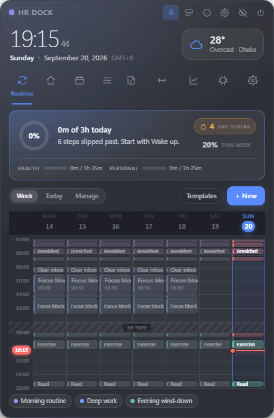
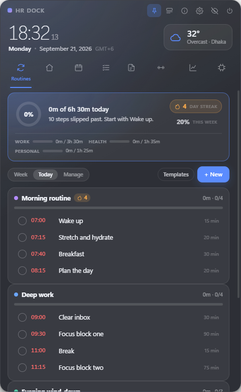
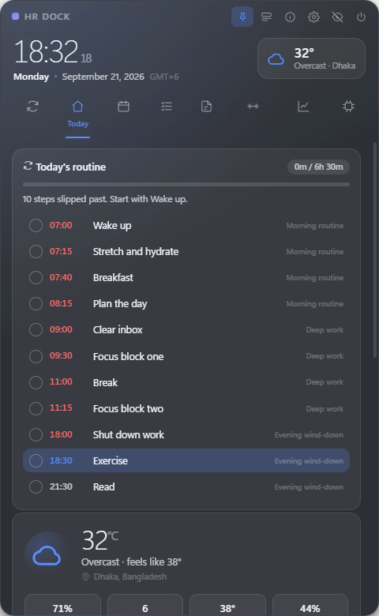
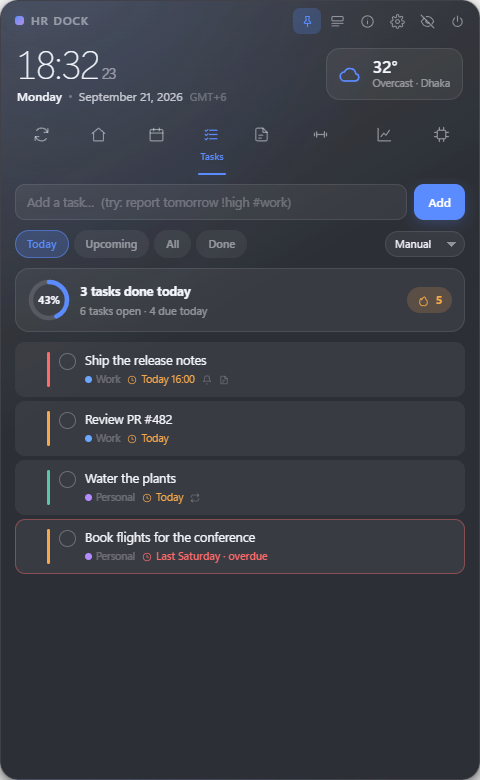
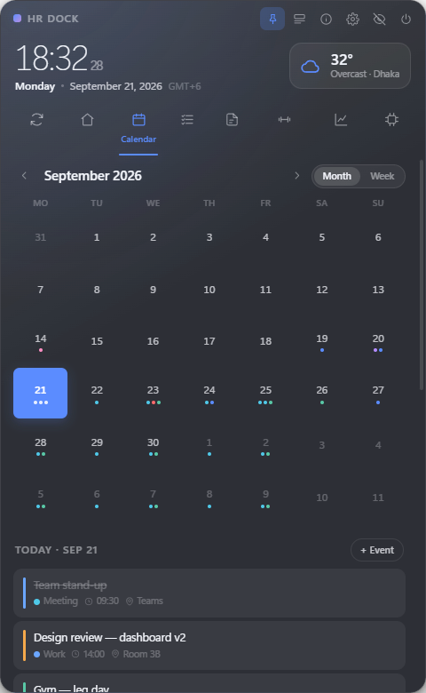
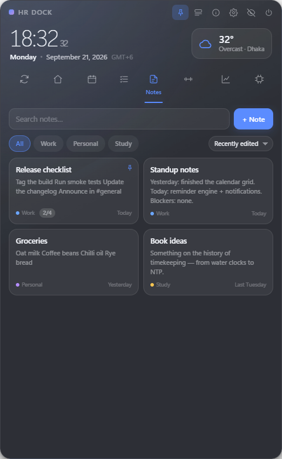
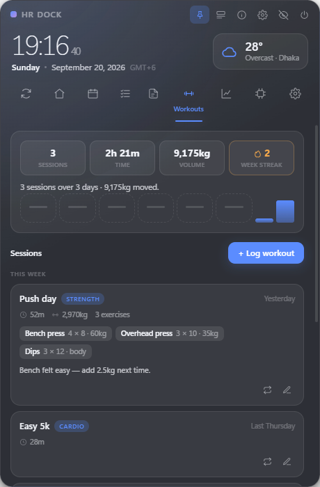

# HR Dock

An always-visible Windows desktop dashboard built around **following your routines**:
your week as a timetable, a step-by-step checklist for today, streaks and consistency
reporting that tell you the truth — plus a clock, calendar, tasks, live weather,
notes, reminders and system monitoring, in one frameless, draggable widget that
starts with Windows.

Local-first. Everything lives in a single JSON file on your machine; the only
network request the app ever makes is the weather lookup.


<p align="center">
  
  
  
  
  
  
  
</p>

---

## Quick start

```bash
npm install          # if the Electron binary fails to download, run: node node_modules/electron/install.js
npm start            # launch the widget
npm test             # run the test suite (52 checks, no dependencies)
npm run dist         # build a Windows installer + portable exe into dist/
```

First launch parks the widget near the top-right of the primary display, adds a
tray icon, and creates `%APPDATA%/HR Dock/hrdock-data.json`.

---

## What's in it

**Clock & date** — real-time to the second with a self-correcting timer, 12/24-hour,
automatic timezone from the OS, weekday/month/year, and a resume handler so the
display is right after the machine wakes.

**Calendar** — month grid and week strip, colour-coded dots per category, click to
select a day, double-click to add, arrow-key navigation, `T` for today, wheel to page.
Events carry title, start/end, category, priority, location, notes, reminder offset
and repetition (daily / weekdays / weekly / monthly / yearly, with an optional end
date). A single occurrence of a series can be skipped without deleting the series.

**Daily schedule** — the day as a timeline with a live "now" marker, past events
dimmed, in-progress events highlighted, tick-off per day (so a repeating event can be
done today and pending tomorrow), and inline edit/skip/delete.

**Tasks** — quick-add understands plain language:

```
report tomorrow 5pm !high #work        →  due tomorrow 17:00, high priority, Work
water plants every week                →  repeating weekly
call bank friday !crit                 →  due Friday, critical
```

Plus drag-to-reorder, four priorities, categories, due dates and times, recurring
tasks that roll forward to their next occurrence when completed, filters
(Today / Upcoming / All / Done), sorting, a completion ring and a daily streak.

**Routines — the centre of the app.** A routine is a named set of timed steps that
repeats on the weekdays you choose — classes, study blocks, meals, chores, work,
winding down. Not a workout planner — anything you do on a schedule belongs here.
The app opens on this tab, because creating a routine is the easy part and
following one is the point.

*Three ways to look at the same week:*

- **Week** — your routines drawn as a timetable, the way a class schedule is drawn:
  seven day columns, hour rows, colour-coded blocks sized by how long each step
  takes. **The whole week fits on one screen**: empty stretches — the hours between
  lunch and the evening, say — collapse into a marked *4h free* fold, and the grid
  scales itself to the window rather than making you scroll past dead time.
  Overlapping steps sit side by side, today's column is tinted, a red line tracks
  the current time, and clicking a block on today ticks that step off.
- **Today** — the day as a checklist grouped by routine, each with its own progress
  bar and streak, plus a seven-day consistency strip underneath.
- **Manage** — create, edit, pause or delete. Pausing keeps the history.

Six templates cover ordinary life — morning routine, class day, study block, work
day, home & chores, evening wind-down — and every one is meant to be edited rather
than followed literally.

*What keeps you honest:*

- A **momentum strip** at the top of every routine view, counted in time rather
  than ticks: "1h 40m of 4h today", a bar per kind of work — study, work, general —
  your streak, the share of this week's hours you actually put in, and one plain
  sentence about where you stand: "1h 40m in, 2h 20m to go. Focus block two in 12
  min." A four-step morning and a four-hour study block are not the same amount of
  day, and a step tally said they were. Every line is derived from the hours
  themselves, so it never cheers for nothing.
- **A reminder per step**, at whatever lead time you set.
- **One follow-up nudge** if a step is still untouched ten minutes after its time.
  Exactly one — a routine you quietly skip should say something, but nagging is how
  people turn reminders off.
- **Streaks that understand your schedule**: consecutive days you finished every
  step, counting only the days a routine actually runs, so a weekday routine is not
  broken by Saturday. Today stays "in progress" until you finish it rather than
  breaking the streak at midnight.
- **Consistency reporting** in Insights: fourteen-day adherence bars, perfect-day
  count, thirty-day rate, and a per-routine breakdown.

Reminders can be ticked off from the notification card itself, and opening one lands
on the Today checklist rather than the timetable — the shortest path from "you were
going to do this" to "done".


**Workouts** — training gets its own tab rather than pretending to be a routine.
A routine step is time you *meant* to spend and either did or did not; a workout is
work you already did, and what makes it worth recording — the load, and whether it
went up — has nowhere to live on a timetable.

Each session is a name, a date, a kind (strength, cardio, mobility, sport) and how
long it took, with a row per exercise: sets, reps and load. Leave the load at zero
and it reads as bodyweight rather than as missing data. The week above the log
keeps the count — sessions, time, volume moved, and a run of weeks with at least
one session in them, because missing a Tuesday is not a lapse and missing a
fortnight is. Eight weeks of volume sit underneath as a sparkline. Any session can
be repeated into today with one click, which is most of how a log gets filled in.

Not everyone trains, so the whole tab is optional: **Settings → Modules → Workouts**
hides it, nav entry and all. Loads are written in kg or lb (Settings → Clock &
calendar).

**Weather** — live data from [Open-Meteo](https://open-meteo.com) (no API key, no
account). Temperature, humidity, feels-like, wind, rain probability, pressure, UV,
sunrise/sunset, an hourly strip and a five-day outlook behind a disclosure.
°C/°F, automatic location from your IP or any city you search for, and the last
good reading is kept and shown as stale rather than blanking when offline.

**Notes** — a card grid plus an editor that covers the whole window, with a focus mode
(`Ctrl`+`Shift`+`F`) that hides the toolbar, enlarges the type and grows the window
into a real writing surface, then puts everything back when you leave. The editor takes the markdown
shorthand people already type by reflex, so the toolbar is optional: `# ` for a
heading, `- ` for a bullet, `1. ` for a numbered list, `[] ` for a checkbox, `> ` for a
quote. Enter inside a checklist continues it; Enter on an empty item leaves it. Notes
autosave as you type — the footer says so, and shows "Saving…" then "Saved 14:22" as it
happens — with an explicit **Save** button (`Ctrl`+`S`) and a **Done** button that saves
and closes, because an editor with no visible save control is one you cannot trust.
Notes take their title from the first line if you don't give them one,
and show checklist progress on the card. Search highlights matches, cards can be
pinned, duplicated, coloured and categorised, and a deleted note can be brought back
from the undo toast. `Ctrl`+`K` adds a link; pasted text arrives as plain text (a
pasted URL becomes a link), and stored note HTML is sanitised on the way in and out,
so an imported backup cannot smuggle markup into the app.

**Reminders** — desktop toasts plus in-app cards with snooze and complete actions,
for events, tasks and birthdays (which report the age). Custom lead times, a
synthesised chime, silent mode, and snooze. Missed reminders (machine asleep) are
retired quietly instead of avalanching at login.

**Insights** — completed today with a day-over-day delta, open and overdue counts, a
weekly score (completion rate 70 pts + focused time 30 pts, 5 per hour), current and
best streak, a seven-day bar chart, a month heatmap, category breakdown, and a focus
timer that credits time to the day.

**System monitor** — a full hardware readout, built once and then patched two
seconds at a time so the panel does not rebuild itself under your cursor.

- **Processor** — model, architecture, socket, cores and threads, L2/L3 cache,
  live usage, the real boost clock (read from the performance counter, so it
  shows 5.3 GHz on a 4.4 GHz part rather than the nameplate figure), and a bar
  per hardware thread.
- **Memory** — in use, available, installed, and the modules themselves: size,
  type, configured speed and which slot each sits in.
- **Graphics** — model, vendor, total VRAM, driver, output mode, then live
  usage, temperature, core and memory clocks, VRAM in use, fan speed and power
  draw. Full telemetry comes from `nvidia-smi`, which ships with the NVIDIA
  driver; anything else falls back to the vendor-neutral GPU Engine counter,
  which knows usage and nothing more. Machines with an integrated adapter and a
  virtual display driver report several cards — the one with real memory behind
  it is the one shown, and the others are named underneath.
- **Storage** — every physical drive with its model, bus, media type and SMART
  health, each volume's free space, and live read/write throughput.
- **Power draw** — what the machine is pulling, in the tile row beside CPU,
  memory and graphics. The processor reports its package power through its own
  energy meter (RAPL, via the Energy Meter counter set) and the graphics card
  reports board power through the driver — both are real readings, broken out
  separately in the panel. The board, memory, drives and fans report nothing at
  all on a desktop, so they are a flat allowance you set in **Settings → Other
  system power** (45 W by default). Wall draw is higher again by whatever the
  power supply wastes.
- **Cooling** — every fan that will say. In practice that means the GPU;
  see the limitation below.
- **Network** — download and upload in MB/s with a live graph, lifetime bytes
  received and sent, the active adapter and whether it is Wi-Fi or Ethernet.
- **Machine** — computer name, OS and build, manufacturer and model,
  motherboard, BIOS version and date, processor, graphics, memory, storage and
  uptime, in one panel to read off rather than hunt for.

**Two honest gaps.** CPU temperature and motherboard fan RPM are not readable
here, and the panel says so in place of a number. Consumer desktops do not
publish a CPU thermal zone through WMI, and fan headers sit behind the Super I/O
chip, which Windows does not expose to an unprivileged program at all. Reading
either means shipping a signed kernel driver and running elevated — a large
change in what this widget is, for two figures. GPU temperature and fan speed
*are* shown, because the graphics driver already exposes them.

**Internet speed test** — download and upload in MB/s, ping, idle latency, and
the edge that served the test. It runs only when you press the button.

*How it measures, because the method is the difference between a number and a
guess:*

- **Four streams at once.** One TCP connection cannot fill a fast line — it is
  bounded by window size over round-trip time, so a single stream under-reports
  badly against a distant server. Measured here: 51 Mbps on one stream against
  79 on four. Eight adds nothing, so four it is.
- **Each stream is kept busy.** A transfer that finishes mid-window would leave
  its stream idle while the clock ran; workers start the next one immediately.
- **The warm-up is thrown away.** The first second and a half is TCP feeling
  out the path, and counting it drags the figure below what the line does.
- **Uploads are counted on receipt.** Handing a buffer to a socket is not the
  same as putting it on the wire: the socket and the TLS layer will accept
  megabytes that have not left the machine. Counting writes reported this line
  at 646 Mbps up against 79 down. Only payloads the server has acknowledged
  are counted.
- **Every response is checked.** The endpoint refuses payloads of 100MB and up
  with a 403 and a one-byte body, and rate-limits bursts with a 429. Measuring
  those bodies is how a speed test reports nonsense with total confidence — so
  a refusal is surfaced as a refusal.
- **Latency is a median over a kept-alive connection,** so it is round-trip
  time and not a TLS handshake, and one stalled sample cannot move it. This
  line sits at about 55 ms and throws the occasional 800 ms stall; a mean put
  that at 200 ms.

The two latency figures are the interesting pair. Idle latency is measured with
the line quiet; ping is measured *while the download is saturating it*, by
probing alongside the transfer rather than after it. The gap between them is
bufferbloat — how far your connection's responsiveness falls once it is
actually working, which is what a call or a game feels and what a single idle
ping figure hides.

> It measures against Cloudflare's public speed endpoints — no account and no
> key, and a point of presence close enough that the number means something.
> This is the only request the app makes besides the optional weather lookup,
> and like the weather it is opt-in by action: nothing is sent unless you start
> a test.

**Settings** — one panel, reached from the gear in the header. It used to be a
tab as well; two doors into one room made it look like two features.

**Widget behaviour** — frameless and translucent, drag from anywhere in the header,
edge snapping, eight resize handles, position remembered per mode, multi-monitor
aware (it re-homes itself if a display disappears), always-on-top toggle,
click-through mode, compact mode, opacity slider, tray menu, autostart, and global
shortcuts.

**Finding your way around.** First launch explains the three things a widget with no
taskbar button has to explain — how to show and hide it, that it drags anywhere, and
that hiding is not closing. The ⓘ button in the header reopens that guide any time,
including the quick-add syntax cheat sheet.

**Hiding vs closing.** The ⦸ button (and `Esc`, and `Ctrl`+`Alt`+`A`) *hides* the
widget — it keeps running in the tray so reminders still fire. The ⏻ button beside it
*closes* HR Dock completely: no tray icon, no background services, no reminders until
you launch it again. It asks for confirmation first, and the same action lives in
Settings → Widget behaviour and in the tray menu.

---

## Keyboard

| Shortcut | Action |
| --- | --- |
| `Ctrl`+`Alt`+`A` | Show / hide the widget (global) |
| `Ctrl`+`Alt`+`C` | Toggle compact mode (global) |
| `Ctrl`+`1…8` | Switch tabs |
| `Ctrl`+`N` | New task |
| `Ctrl`+`E` | New event |
| `Ctrl`+`F` | Search notes |
| `Ctrl`+`K` | Add a link (in the note editor) |
| `Ctrl`+`Shift`+`F` | Focus mode while writing a note |
| `←` `→` `↑` `↓` | Move the calendar selection |
| `T` | Jump the calendar to today |
| `Shift`+wheel | Page months on the calendar |
| `Esc` | Close a dialog, or hide the widget |

---

## Architecture

```
src/
  main/          Electron main process — no UI code
    main.js      window, tray, autostart, IPC, global shortcuts, display handling
    store.js     single-JSON store: atomic writes, debounced flushes, rolling backups
    weather.js   Open-Meteo client (all networking lives here)
    system.js    CPU/RAM from Node; disks, battery, net and thermals from one
                 long-lived PowerShell helper that only runs while the tab is open
    reminders.js reminder engine: one 15s tick re-derives what is due
                 (events, routine steps + follow-up nudges, tasks, birthdays)
  preload/
    preload.js   contextBridge: a fixed, typed API — no raw IPC, no Node in the UI
  shared/
    datetime.js  calendar maths and recurrence, shared by main and renderer
  renderer/      UI (no framework, no build step, no bundler)
    index.html   the whole shell
    css/         base tokens & theming, layout, components
    js/          one module per feature, plain scripts with a global namespace
test/            npm test
scripts/         icon generator, demo-data seeder
```

**Why no framework or bundler.** Startup cost and idle cost are the whole point of a
widget that is always on screen. Plain scripts load in order with no hydration step,
no virtual DOM, and no build to keep in sync — the app is the source.

**Security posture.** The renderer runs with `contextIsolation: true`,
`nodeIntegration: false`, a strict CSP (`connect-src 'none'`), navigation blocked, and
`window.open` routed to the system browser. It cannot touch the filesystem or the
network; it asks the main process, which only accepts the calls listed in the preload.

**Performance.** The clock is one self-correcting timer that broadcasts minute and day
ticks instead of every module polling. Saves are debounced per collection and written
atomically. The system monitor's PowerShell helper is spawned only while the System
tab is visible and killed when you leave it. Rendering is scoped to the active tab,
and the clock stops entirely when the window is hidden.

**Measured on a 16-core Windows 11 desktop** (your mileage will vary):

| | |
| --- | --- |
| Cold start to first paint | ~440 ms |
| Idle CPU | ~0.9% of one core (≈0.06% of the machine) |
| Memory | ~235 MB private across 4 processes |
| Render with 300 tasks + 300 events | ~20–90 ms per view |
| Writing 600 records | ~1.2 s |

That memory number is Electron's floor, not this app's code — a Chromium renderer,
a GPU process and the Node main process cost that much before a single line of HR
Dock runs. A native widget (WinUI, Rust, C++) would sit at 30–60 MB. If RAM is the
binding constraint on your machine, that trade-off is the honest reason to choose a
different stack; everything else here (startup, idle CPU, disk writes) is cheap.

---

## Data

Everything is in `%APPDATA%/HR Dock/`:

- `hrdock-data.json` — settings, events, routines, tasks, notes, stats, window bounds
- `backups/` — the ten most recent snapshots

Settings → Data offers backup, restore from any snapshot, export and import (an
import always takes a safety backup first), and a shortcut to the folder.

---

## Notes and limitations

- **"Always visible" means always-on-top, not painted into the wallpaper.** Windows
  has no supported API for parenting a window behind desktop icons; doing it requires
  injecting into Explorer's `WorkerW`, which breaks across Windows updates. HR Dock
  uses the `normal` always-on-top level, so it sits above ordinary windows but never
  covers full-screen apps, games or UAC prompts. Turn the pin off and it behaves like
  a normal window.
- **Acrylic vs glass.** On Windows 11 the widget uses the OS acrylic backdrop; on
  Windows 10 it falls back to a CSS glass surface. Switching backdrop in Settings
  recreates the window, which is a brief flicker by design — the backdrop is a
  property of the OS window handle.
- **Thermals and battery** are read from WMI and simply do not exist on many desktops;
  those gauges are hidden rather than faked.
- **Weather** needs an internet connection on first run to resolve your location.
  Manual location works offline once set, and the last reading is cached.
- **Autostart in development** registers the Electron binary with the project path.
  A packaged build registers the installed executable.

---

## Development

```bash
npm run dev          # opens DevTools alongside the widget
npm test             # date maths, recurrence, task rollover, reminder engine
npm run icon         # regenerate assets/icon.png and build/icon.ico
```

Two test affordances are built into the main process:

```bash
# run against a throwaway profile with realistic demo data
node scripts/seed-demo.js /tmp/profile today
HRDOCK_USER_DATA=/tmp/profile npm start

# screenshot the rendered widget and exit
HRDOCK_USER_DATA=/tmp/profile npx electron . --capture=/tmp/shot.png
```

`HRDOCK_CAPTURE_DELAY` (ms) controls how long to wait before the capture — useful for
the System tab, whose first disk reading takes a couple of seconds.

---

## Building the .exe

```powershell
npm run dist
```

Produces two files in `dist\`:

| File | Use |
| --- | --- |
| `HR Dock Setup 1.0.0.exe` | Installer — Start-menu entry, proper uninstall, and autostart points at the installed exe. Per-user, no admin needed. |
| `HR Dock 1.0.0.exe` | Portable — one file, runs from anywhere. Unpacks to `%TEMP%` on each launch, so it starts a little slower. |

Both are unsigned, so SmartScreen shows *"Windows protected your PC"* the first time:
**More info → Run anyway**. Signing needs a paid code-signing certificate; set `CSC_LINK`
and `CSC_KEY_PASSWORD` if you ever have one.

**If the build fails with `Cannot create symbolic link`:** electron-builder's code-signing
package contains macOS symlinks, and creating symlinks on Windows requires admin rights or
Developer Mode. Either enable Developer Mode (Settings → System → For developers), or
pre-extract that cache yourself and let the build reuse it:

```powershell
$cache = "$env:LOCALAPPDATA\electron-builder\Cache\winCodeSign"
.\node_modules\7zip-bin\win\x64\7za.exe x "$cache\*.7z" -o"$cache\winCodeSign-2.6.0" -y
npm run dist
```

The two macOS `.dylib` symlinks it fails on are irrelevant to a Windows build.

**Close HR Dock before rebuilding.** A running instance holds a lock on
`distHR Dock 1.0.0.exe`; electron-builder then leaves the old portable file in place
while happily rebuilding everything else, so you get a "new" build that runs old code.
Quit from the tray (or the ⏻ button) first.

## Licence

MIT.
Weather data by Open-Meteo (CC BY 4.0).
